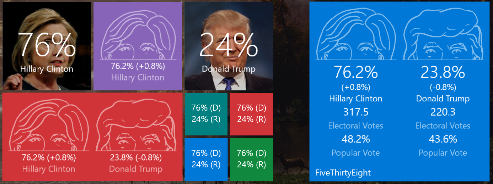

# UWP-FiveThirtyEight-LiveTile
UWP App implementing Live-Tile functionality to display presidential race data from fivethirtyeight.com

Starting this app once will register a Background-Process polling fivethirtyeight.com every 15 minutes to get the latest confidence scores of Nate Silvers model.

# Live-Tile

All Live-Tile sizes (small, medium, wide, large) are supported and will show the overall confidence scores for the candidates.

When the numbers change, a trend will also be displayed.

You can choose between fivethirtyeights cartoon heads and actual photos of the candidates to be displayed on the medium sized tile.
The large tile will also display the predicted Electoral Votes and Popular Vote.

# Notifications

You can choose to receive a notification when the numbers change.
